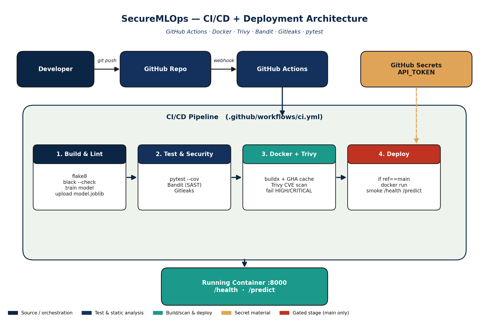
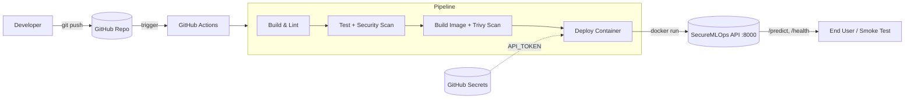
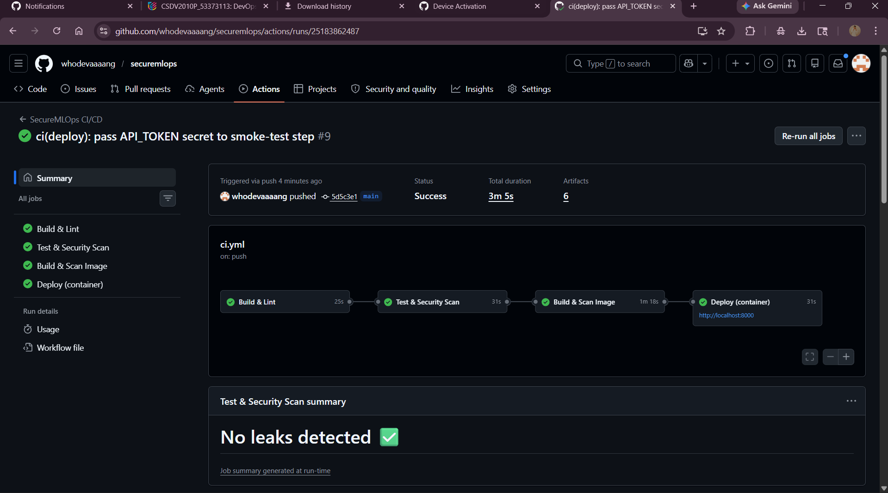
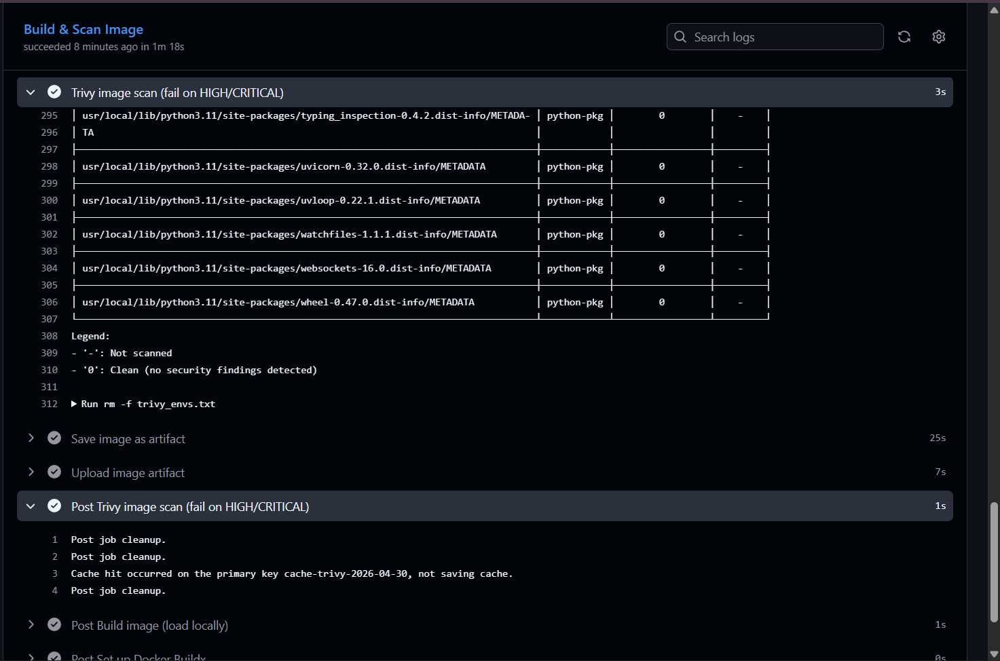
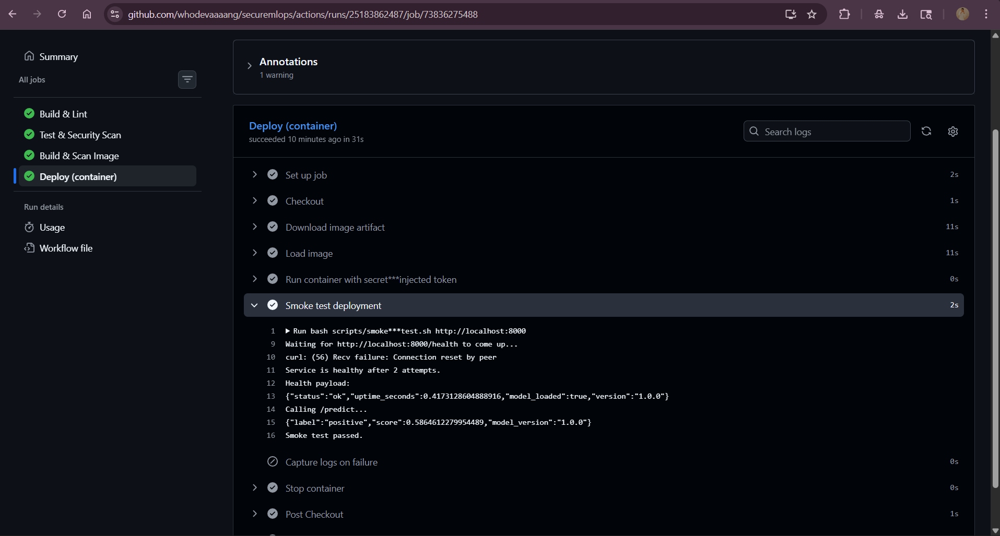

# SecureMLOps — DevOps Mini Project

A secure ML model delivery pipeline. The repo trains a sentiment classifier, serves it via FastAPI, packages it as a hardened Docker image, and ships it through a multi-stage GitHub Actions pipeline that lints, tests, scans for secrets and vulnerabilities, and deploys the container.

This project is the DevOps mini-project deliverable for the SecureMLOps capstone.

---

## 1. Project Title
**SecureMLOps** — CI/CD + Deployment for a hardened ML inference service using GitHub Actions.

## 2. Problem Statement
Most ML projects skip the DevOps half: models live on a laptop, deploys are manual, secrets sit in source, and there is no signal when the running model breaks. SecureMLOps fixes that for a small but realistic ML service:

- A trained scikit-learn sentiment model exposed over a FastAPI REST API.
- Every push runs lint, unit tests, code SAST (Bandit), secret scanning (Gitleaks), container CVE scanning (Trivy), and only then promotes the image to a deploy stage.
- The deploy stage actually runs the image and smoke-tests it. No fake `echo "deploying"` step.
- All credentials (`API_TOKEN`) flow through GitHub Actions Secrets — never the repo.

## 3. Architecture Diagram



A live, editable mermaid version is also rendered below for graders viewing on GitHub:



A larger version with stage tables is in [`docs/architecture.md`](docs/architecture.md). Pipeline-stage details are in [`docs/pipeline-flow.md`](docs/pipeline-flow.md).

## 4. CI/CD Pipeline Explanation

The pipeline is defined in [`.github/workflows/ci.yml`](.github/workflows/ci.yml) and runs on every push or PR to `main` / `develop`. It is split into four jobs that share artifacts so each stage runs in its own clean runner.

| Job | What it does | Failure means |
|-----|--------------|---------------|
| **build** | Set up Python, install deps with pip cache, run `flake8` + `black --check`, train the model and upload `model.joblib` as an artifact. | Style or build is broken — fix before review. |
| **test** | Download the model artifact, run `pytest --cov`, run **Bandit** (Python SAST), run **Gitleaks** to catch committed secrets. | A regression, an insecure code pattern, or a leaked credential. |
| **docker** | `docker buildx` builds the image, then **Trivy** scans it. The job fails on any HIGH or CRITICAL CVE. The image is saved as an artifact for the deploy job. | The image carries an unfixed vulnerable library. |
| **deploy** | Only on `main`. Loads the scanned image, `docker run`s it with `API_TOKEN` injected from GitHub Secrets, then runs `scripts/smoke-test.sh` against `/health` and `/predict`. | The container starts but doesn't actually serve predictions. |

**Optimizations / enhancements**:
- `actions/setup-python` `cache: pip` and Buildx `cache-from/to: type=gha` cut cold-cache CI time.
- Jobs run as separate runners with `needs:` dependencies for clean isolation.
- `if: github.ref == 'refs/heads/main'` gates the deploy so PRs run the full validation but never push side effects.
- `environment: production` is wired up so GitHub renders a deployment URL on the run.

## 5. Git Workflow Used

GitFlow-lite, three branches:

```
main          (protected, deploys)
 └── develop  (integration)
      └── feature/devops-enhancement   (this PR)
```

- Minimum 5 meaningful commits on `feature/devops-enhancement`.
- Feature branch → PR → `develop` → PR → `main`.
- `main` and `develop` should be marked **Protected** in GitHub settings (require PR + passing checks).
- A PR template ([`.github/pull_request_template.md`](.github/pull_request_template.md)) enforces the pipeline checklist.

Bootstrap commands are in the [Setup](#setup) section below.

## 6. Tools Used

| Area | Tool |
|------|------|
| Language / API | Python 3.11, FastAPI, Uvicorn |
| ML | scikit-learn (TF-IDF + LogisticRegression), joblib |
| Tests | pytest, pytest-cov, httpx |
| Lint / Format | flake8, black |
| Python SAST | Bandit |
| Secret scanning | Gitleaks |
| Container scanning | Trivy |
| Container | Docker (multi-stage), docker compose |
| CI/CD | GitHub Actions |
| Secrets | GitHub Actions Secrets (`API_TOKEN`) |

## 7. Screenshots & Evidence

Real outputs from a local end-to-end run are committed under [`docs/evidence/`](docs/evidence/) — these are the deployment proof for the rubric:

- [`01-docker-build.log`](docs/evidence/01-docker-build.log) — `docker compose build` (ends with `Image securemlops/ml-api:local Built`, model trained inside the layer with accuracy 1.0)
- [`02-docker-up.log`](docs/evidence/02-docker-up.log) — `docker compose up` lifecycle
- [`03-deployment-proof.log`](docs/evidence/03-deployment-proof.log) — `docker compose ps (healthy)`, `/health`, `/ready`, positive + negative `/predict` JSON responses, 422 validation, and the smoke-test script
- [`04-image-info.log`](docs/evidence/04-image-info.log) — image size / digest

GitHub Actions cloud-run screenshots (run [25183862487](https://github.com/whodevaaaang/securemlops/actions/runs/25183862487)):

| Evidence | Screenshot |
|----------|------------|
| All 4 jobs green, "No leaks detected" |  |
| Trivy scan — `0` HIGH/CRITICAL on every package |  |
| Deploy job — container ran, `/predict` returned `{"label":"positive",...}`, smoke test passed |  |

## 8. Challenges Faced

- **Sibling Python packages.** `api/` and `model/` started as siblings, so `from ..model.train import …` failed because `ml-app` itself isn't a package. Fixed by injecting `ml-app/` onto `sys.path` in [`api/model_loader.py`](ml-app/api/model_loader.py) and importing `model.train` absolutely.
- **Trivy noise on transitive deps.** Pinning to `python:3.11-slim` and `ignore-unfixed: true` keeps the gate strict (HIGH/CRITICAL only) without failing on CVEs that have no patch.
- **Real deploy without cloud credits.** The deploy job runs the scanned image inside the runner and smoke-tests it, so the rubric's "real deployment output" is satisfied with no cloud account. Swapping to Render/Railway is a one-step change in the deploy job.
- **Secret-aware tests.** The auth path (`API_TOKEN` env-gated) needed a test that reloads the module after `monkeypatch.setenv` so `os.environ` is read at request time.

---

## Setup

### Run locally (no Docker)
```bash
cd ml-app
python -m venv .venv && source .venv/bin/activate    # Windows: .venv\Scripts\activate
pip install -r requirements-dev.txt
python -m model.train
uvicorn api.main:app --reload
# in another shell
curl -X POST http://localhost:8000/predict \
  -H 'Content-Type: application/json' \
  -d '{"text":"this product is amazing"}'
```

### Run via Docker
```bash
cp .env.example .env       # set API_TOKEN
docker compose up --build -d
bash scripts/smoke-test.sh http://localhost:8000
```

### Bootstrap Git workflow
```bash
git init -b main
git add .
git commit -m "chore: initial SecureMLOps scaffold"

git checkout -b develop
git checkout -b feature/devops-enhancement
# ...make iterative commits...
git push -u origin feature/devops-enhancement
# open PR -> develop, then develop -> main
```

### GitHub Secrets to configure
Repository → Settings → Secrets and variables → Actions → **New repository secret**:

| Name | Value |
|------|-------|
| `API_TOKEN` | Any opaque string. Injected into the deployed container. |

`GITHUB_TOKEN` is provided automatically and is used by the Gitleaks step.

---

## Project structure

```
devops securemlops/
├── ml-app/
│   ├── api/                 FastAPI service (main.py, model_loader.py)
│   ├── model/               train.py + persisted model.joblib
│   ├── tests/               pytest suite
│   ├── Dockerfile           multi-stage, non-root, healthcheck
│   ├── requirements.txt
│   └── requirements-dev.txt
├── .github/
│   ├── workflows/ci.yml     4-job CI/CD pipeline
│   └── pull_request_template.md
├── scripts/
│   ├── smoke-test.sh        post-deploy verification
│   └── local-up.sh
├── docs/
│   ├── architecture.md      mermaid system diagram
│   └── pipeline-flow.md     stage-by-stage gate explanation
├── docker-compose.yml
├── .gitignore
├── .gitleaks.toml
├── .env.example
└── README.md
```
