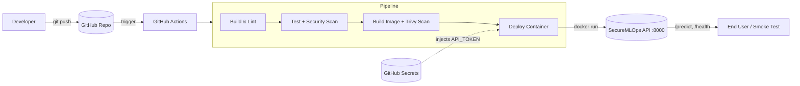

# Architecture

## System diagram

## Pipeline stages

| Stage | Job | Gate |
|------|-----|------|
| 1 | Build & Lint | flake8, black, model train |
| 2 | Test & Security | pytest + coverage, Bandit, Gitleaks |
| 3 | Docker Build & Scan | Buildx + Trivy (HIGH/CRITICAL fail) |
| 4 | Deploy | Run container, smoke test, only on `main` push |

## Branching strategy (GitFlow-lite)

- `main` — production-ready; protected, requires PR.
- `develop` — integration branch.
- `feature/*` — short-lived feature branches off `develop`.

A merge from `feature/devops-enhancement` to `develop`, then `develop` to `main` simulates the full GitFlow promotion.
