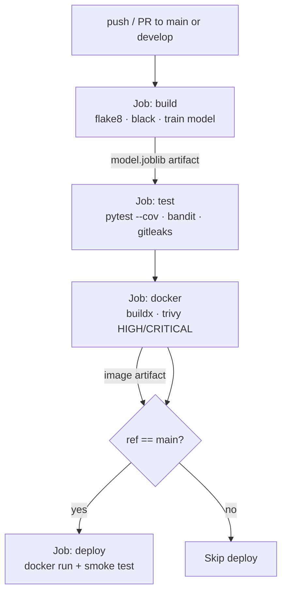

# Pipeline flow

## Why each gate exists

| Gate | Failure mode it catches |
|------|------------------------|
| flake8 / black | Style drift and dead code before review |
| pytest | Behavioural regressions (predict + health + auth) |
| Bandit | Python-specific insecure patterns (eval, weak crypto, hardcoded passwords) |
| Gitleaks | Hardcoded secrets accidentally committed |
| Trivy (HIGH/CRITICAL) | Vulnerable OS / Python libraries shipped in the image |
| Smoke test | Container starts but `/predict` is broken — caught before declaring deploy success |
